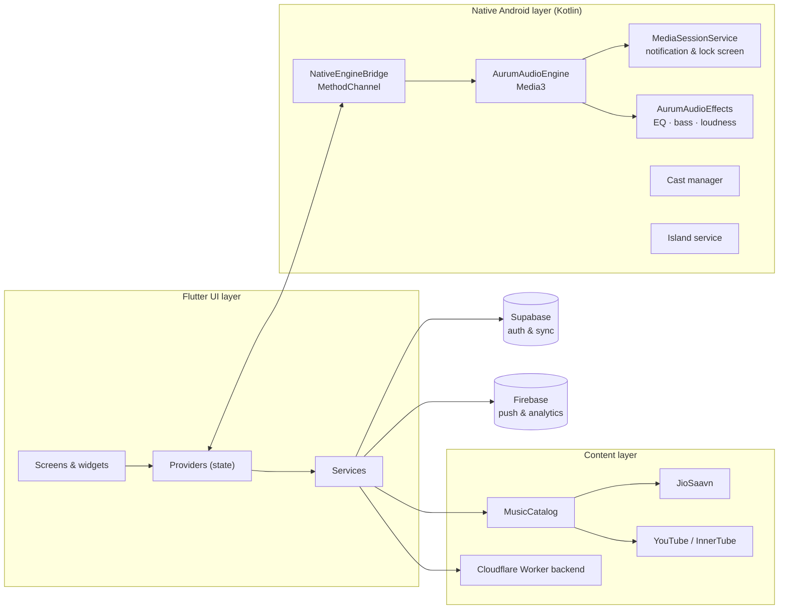

<div align="center">


# Astra Music

**Crafting symphonies in code.**

A premium, lightweight music streaming app for Android, built with Flutter and a fully native Kotlin audio engine.

<br/>

[](https://github.com/shivam-s01/Aurum-app/releases/latest)
[](https://github.com/shivam-s01/Aurum-app/releases/latest)
[](https://flutter.dev)
[](https://developer.android.com/media/media3)
[](#-localization)

<br/>

[**Download**](https://github.com/shivam-s01/Aurum-app/releases/latest) &nbsp;·&nbsp;
[**Features**](#-features) &nbsp;·&nbsp;
[**Architecture**](#-architecture) &nbsp;·&nbsp;
[**Build**](#-build-from-source) &nbsp;·&nbsp;
[**Support the project**](https://astra.mmusic.workers.dev/support)

</div>

---

## ✨ Overview

Astra Music is built around one idea: a streaming app should feel premium without being heavy. Every screen is designed to look and move like the best apps in the category, while the engine underneath is tuned to stay fast, cool and frugal on low-end hardware.

Playback runs on a **native Media3 engine written in Kotlin**, not on a Flutter audio plugin. That keeps the background service stable, the lock-screen controls instant and the battery impact low, while the Flutter UI stays smooth on top of it.

| | |
|---|---|
| 🎧 **Native audio engine** | Media3 session service with its own DSP chain, gapless playback and crossfade |
| 🪞 **Premium interface** | Liquid-glass navigation, Material You colors and artwork-driven backgrounds |
| ⚡ **Cache-first** | Home loads from cache on launch; the network is used only when it has to be |
| 🌍 **Global** | 26 languages and regional content catalogs |

---

## 🎯 Features

### Playback
- **Native Kotlin/Media3 engine** with a dedicated `MediaSessionService` for reliable background playback and lock-screen / notification controls
- **Gapless playback and crossfade**
- **Built-in equalizer** with bass boost, virtualizer and loudness enhancement, managed by a gain budget to avoid clipping and crackle
- **Waveform seek bar** for precise scrubbing
- **Queue control** with reorder, remove and play-next, plus loop (off / all / one) and shuffle
- **Smart auto-queue** that keeps the music going with related tracks and de-duplicates what is already queued
- **Sleep timer** and an **auto sleep guard**
- **Chromecast support** with discovery that stays idle until you actually need it

### Discovery
- **Multi-source catalog** covering JioSaavn and YouTube Music behind a single search contract, with priority, retry and fallback handled for you
- **Fast search** with real-time suggestions and a short debounce
- **Moods & genres**, artist pages, album pages and personalized mixes
- **Recommendation engine** that filters for quality and surfaces related songs and artists
- **Regional catalogs** so Home reflects where you are

### Lyrics
- **Line-synced lyrics** in LRC format, with a clean plain-text fallback when synced data is not available

### Library & Offline
- **Favorites, playlists, followed artists and albums, and listening history**
- **Offline downloads** saved through Android MediaStore, with embedded ID3 artwork
- **Cloud sync** across devices through Google sign-in

### Design & Personalization
- **Liquid-glass navigation bar and mini player**
- **Material You** dynamic color on Android 12+
- **Palette-extracted player backgrounds** that follow the current artwork
- **Dynamic Island overlay** with adjustable position, size and accent color
- **Home-screen widget**
- Smooth shared transitions, haptic feedback and a **reduce-animations** mode that is respected across the app

### Efficiency & Privacy
- **Battery saver and data saver modes**
- **Bounded image cache** so storage never grows without limit
- **App lock** with biometric / device authentication
- In-app **privacy policy and terms**, available from the Astra website

### Astra Plus
An optional premium tier with a dedicated paywall. Payments are processed by Cashfree and verified server-side, so premium access is never granted from the client alone.

---

## 🏗 Architecture



**Design principles**

1. **Native where it matters.** Audio, background service, casting and the overlay run in Kotlin. Flutter owns the interface.
2. **One contract per concern.** Search and similar-song lookups go through a single `MusicCatalog` entry point, so retry and priority rules live in one place.
3. **Cache first, network second.** A cold start with a warm cache uses no mobile data; the network is touched on first launch or a manual refresh.
4. **No dead code.** Unused paths are removed rather than commented out.

---

## 🧰 Tech Stack

| Layer | Technology |
|---|---|
| UI framework | Flutter 3.35 (stable) · Dart 3 |
| State management | Provider |
| Native audio | Kotlin · AndroidX Media3 · Android `audiofx` |
| Casting | Google Cast SDK |
| Local storage | Hive · SharedPreferences |
| Networking | `http` · `dio` |
| Auth & sync | Supabase · Google Sign-In |
| Messaging & analytics | Firebase Cloud Messaging · Firebase Analytics |
| Payments | Cashfree |
| Backend | Cloudflare Workers |
| Theming | `dynamic_color` · `palette_generator` · `google_fonts` · `liquid_glass_easy` |
| Build | Gradle (AGP 8.9) · JDK 17 · GitHub Actions |

---

## 📲 Download

Pre-built, signed APKs are published on every release.

1. Open the [**latest release**](https://github.com/shivam-s01/Aurum-app/releases/latest).
2. Download the APK that matches your device. Most modern phones use **`arm64-v8a`**.
3. Open the file and allow installation from your browser or file manager when Android asks.

The app checks GitHub Releases for new builds and can notify you when an update is available.

---

## 🛠 Build from Source

### Requirements

- Flutter **3.35** (stable)
- JDK **17**
- Android SDK with a recent platform and build tools

### Steps

```bash
# 1. Clone
git clone https://github.com/shivam-s01/Aurum-app.git
cd Aurum-app

# 2. Install dependencies (localization files are generated automatically)
flutter pub get

# 3. Run on a connected device
flutter run

# 4. Or build a release APK, split per ABI
flutter build apk --release --split-per-abi
```

Output: `build/app/outputs/flutter-apk/`

> **Note:** Firebase features need your own `android/app/google-services.json`. Release signing reads `android/key.properties`; without it, use a debug build.

---

## 🚀 CI / CD

Builds run entirely on **GitHub Actions**, so no local toolchain is needed to ship.

- **Trigger:** every push to `main`, or manually from the Actions tab
- **Safety gate:** `flutter analyze` must pass before a build is produced
- **Signing:** a permanent release keystore is decoded from encrypted repository secrets at build time
- **Output:** obfuscated, split-per-ABI release APKs
- **Release:** a GitHub Release is created automatically with a categorized changelog generated from commit messages
- **Auto-update feed:** the update manifest is refreshed after each release so installed apps can detect the new build

---

## 📁 Project Structure

```text
lib/
├── main.dart
├── config/        Language and region catalogs
├── l10n/          26 ARB localization files
├── models/        Song, artist, lyrics, download models
├── providers/     Player, library, favorites, playlists, auth, premium, theme
├── services/      API, catalog, native bridge, downloads, sync, cache, updates
├── screens/       Home, search, player, library, settings, onboarding, premium
├── widgets/       Mini player, glass surfaces, seek bar, sheets, shared UI
├── theme/         Design tokens and theming
└── utils/         Haptics, motion, transitions, constants

android/app/src/main/kotlin/com/aurum/music/
├── AurumAudioEngine.kt           Media3 playback engine
├── AurumMediaSessionService.kt   Background service & media session
├── AurumAudioEffects.kt          Equalizer, bass boost, loudness
├── AurumCastManager.kt           Chromecast
├── AurumIslandService.kt         Dynamic Island overlay
├── AurumWidgetProvider.kt        Home-screen widget
└── …                             Stream resolvers, downloads, diagnostics
```

---

## 🌍 Localization

Astra Music ships with **26 languages**, driven by ARB files and Flutter's built-in `gen-l10n`.

English · Hindi · Tamil · Punjabi · Urdu · Persian · Arabic · French · Spanish · Portuguese · Italian · German · Dutch · Swedish · Polish · Romanian · Ukrainian · Russian · Greek · Turkish · Indonesian · Vietnamese · Thai · Japanese · Korean · Chinese (Simplified)

**Adding a language:** create `lib/l10n/app_xx.arb`, then register the locale in `lib/config/languages.dart`.

---

## 💖 Support the Project

Astra Music is built and maintained by one independent developer, and it has no ads. If it has made your day better, a small tip goes a long way toward keeping it improving.

<div align="center">

### [**💖 Support Astra Music →**](https://astra.mmusic.workers.dev/support)

</div>

Tips are entirely optional and unlock nothing. Sharing the app with a friend helps just as much.

---

## 🤝 Connect

Built by **Shivam Sharma**

[](https://www.instagram.com/shivam_shrma.01)
[](https://t.me/mr_s_s01)
[](https://linkedin.com/in/shivam-s01)
[](https://github.com/shivam-s01)

Found a bug or have an idea? [Open an issue](https://github.com/shivam-s01/Aurum-app/issues) or message on Telegram.

---

## 📜 Legal

- [Privacy Policy](https://astra.mmusic.workers.dev/privacy)
- [Terms of Use](https://astra.mmusic.workers.dev/terms)

**Disclaimer.** Astra Music is an independent project and is not affiliated with, endorsed by or sponsored by JioSaavn, YouTube or Google. All music, artwork and trademarks belong to their respective owners. The app provides access to publicly available streams and is intended for personal use.

<div align="center">

<br/>

**© 2026 Shivam Sharma. All rights reserved.**

<sub>Crafted with Flutter, Kotlin and a lot of late-night music.</sub>

</div>
